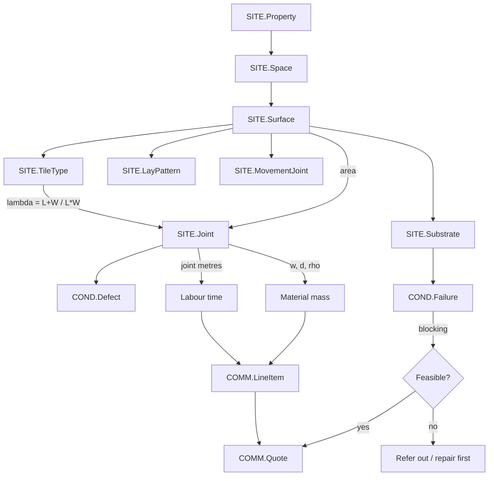
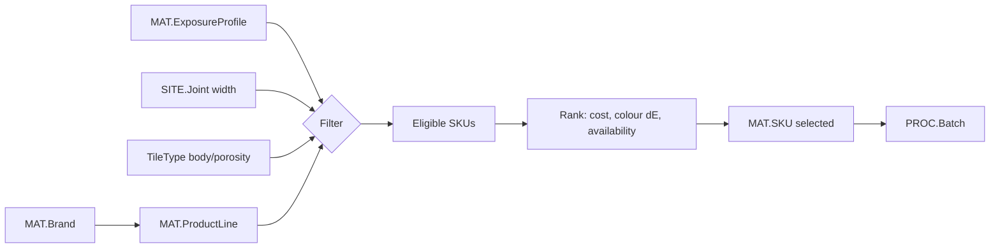
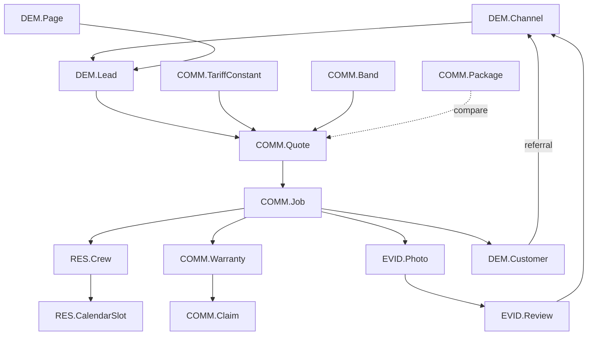

# Node Model

Every entity in this business — physical, procedural, commercial and demand-side —
expressed as a typed node with attributes and edges. The result is a computable
graph: a quote, a material order, a work schedule, a warranty reserve and a lead
priority are all traversals over it.

Node IDs use `DOMAIN.Name`. Attributes are `name: type [unit]`.
Edges are typed and directed, written `A —relation→ B (cardinality)`.

Domains:

| Code | Domain | What it holds |
|---|---|---|
| `SITE` | Geometry & site | The physical thing being worked on |
| `COND` | Condition | Defects, failures, hazards, progression |
| `MAT` | Material | Brands, product lines, SKUs, properties, ancillaries |
| `PROC` | Process | Operations, tools, batches, environment, QC |
| `RES` | Resource | Installers, crews, vehicles, calendar |
| `COMM` | Commercial | Tariff, quotes, packages, jobs, warranty, payment |
| `DEM` | Demand | Channels, pages, leads, funnel, customers |
| `EVID` | Evidence | Photos, receipts, certificates, reviews |

---

## 1. SITE — geometry and site

### SITE.Property
```
id            : uuid
type          : enum{HDB_3R, HDB_4R, HDB_5R, HDB_EXEC, BTO, CONDO, LANDED, COMMERCIAL}
age_yr        : int
postal        : string
region        : enum{North, NE, East, West, Central, JB}
floor_level   : int
lift_access   : bool          -- affects mobilisation F
parking       : enum{season, hourly, street, none}
occupied      : bool          -- drives one-bathroom-at-a-time constraint
```
Edges: `—has→ SITE.Space (1:n)`, `—served_by→ DEM.Channel (n:1)`

### SITE.Space
```
id            : uuid
function      : enum{bathroom, kitchen, living, dining, bedroom, balcony, yard, corridor, store}
wet           : bool
ventilation   : enum{mechanical, natural, none}
sole_facility : bool          -- the only toilet in the flat → scheduling constraint
```
Edges: `—has→ SITE.Surface (1:n)`, `—exposes→ MAT.ExposureProfile (n:1)`

### SITE.Surface
The unit of measurement. Everything priced attaches here.
```
id            : uuid
plane         : enum{floor, wall, ceiling, kerb, step, niche, benchtop}
area_m2       : float [m²]
height_m      : float [m]     -- walls: used with perimeter to derive area
perimeter_m   : float [m]
openings_m2   : float [m²]    -- doors, windows, mirrors — subtracted
access        : enum{open, behind_fixture, under_fixture, tight}
```
Edges: `—tiled_with→ SITE.TileType (n:1)`, `—laid_in→ SITE.LayPattern (n:1)`,
`—over→ SITE.Substrate (n:1)`, `—contains→ SITE.Joint (1:1 derived)`,
`—bounded_by→ SITE.MovementJoint (1:n)`, `—obstructed_by→ SITE.Fixture (1:n)`

### SITE.TileType
```
id            : uuid
L_mm, W_mm    : float [mm]    -- face dimensions; drives λ
thickness_mm  : float [mm]    -- upper bound on joint depth
body          : enum{porcelain, ceramic, homogeneous, mosaic, natural_stone, terrazzo, quarry}
finish        : enum{polished, matt, rustic, textured, anti_slip, lappato}
rectified     : bool          -- rectified → narrower joints feasible
porosity_pct  : float [%]     -- porous/unglazed → grout release agent required
colour_lab    : {L, a, b}     -- for ΔE colour matching
```
**Key derived attribute:** `lambda = (L+W)/(L·W)·1000` [m of joint per m²].

### SITE.LayPattern
```
kind          : enum{stack, running_half, running_third, herringbone, basketweave, modular}
offset_frac   : float
```
Note: by Theorem 1 (see `MATH.md` §1.1) λ is **invariant** to pattern for congruent
rectangles. Pattern affects cut waste and setting-out time, not joint length.

### SITE.Joint
```
id                : uuid
width_mm          : float [mm]   -- w
depth_mm          : float [mm]   -- d, bounded by tile thickness
existing_material : enum{cement_CG1, cement_CG2, epoxy, urethane, none, unknown}
condition_grade   : int 0..5     -- 0 sound, 5 missing
length_m          : float [m]    -- derived: area_m2 × lambda
```

### SITE.MovementJoint
Grout must **not** go here. Separate node because it is separately priced and
separately warranted.
```
kind          : enum{perimeter, plane_change, structural, field, fixture_junction}
length_m      : float [m]
required      : enum{silicone_neutral, silicone_acetoxy, PU, polyurea}
```

### SITE.Substrate
```
kind          : enum{screed, render, backing_board, slab, existing_tile}
moisture_pct  : float [%]
membrane      : enum{present, absent, unknown}
soundness     : enum{sound, drummy, cracked}
```
Edges: `—gates→ PROC.Op` (a failed substrate blocks the job — see ALG-8)

### SITE.Fixture
```
kind          : enum{wc, basin, vanity, shower_screen, floor_trap, cabinet, hob, sink, bathtub}
removable     : bool
obstructs_m2  : float [m²]
```

### SITE.Access
```
water, power  : bool
lift_size     : enum{none, small, service}
hours_window  : {start, end, days[]}   -- HDB noisy-work restrictions
noise_limited : bool
```

---

## 2. COND — condition

### COND.Defect
```
id            : uuid
mode          : enum{mould, staining, cracking, erosion, powdering,
                     efflorescence, missing, peeling, discolour}
severity      : int 1..5
coverage_pct  : float [%]
cause         : enum{porosity, movement, water_ingress, chemical, wear, poor_install}
```

### COND.Failure
Blocking conditions. Presence flips the job from "grouting" to "not a grouting job".
```
mode          : enum{drummy_tile, loose_tile, membrane_failure, leak_below,
                     structural_movement, rising_damp, substrate_crack}
blocking      : bool
```

### COND.Progression
```
state         : enum{cosmetic, ingress, structural}
hazard_rate_h : float [/yr]      -- transition intensity, cosmetic → ingress → structural
cost_at_state : {cosmetic: SGD, ingress: SGD, structural: SGD}
```

### COND.Hazard
```
silica_dust   : bool             -- respirable crystalline silica from dry cutting
sensitiser    : bool             -- epoxy amine hardeners → dermatitis
height_work   : bool
confined      : bool
```

---

## 3. MAT — material

### MAT.Brand
```
id, name, origin_country, sg_distributor, availability: enum{stocked, indent, none}
```
Edges: `—produces→ MAT.ProductLine (1:n)`

### MAT.ProductLine
```
id                : uuid
chemistry         : enum{epoxy_2K, epoxy_3K, urethane_1K, polyurea, cement_CG2,
                         cement_CG1, hybrid}
en13888_class     : enum{CG1, CG2, CG2W, CG2A, CG2WA, RG}
ansi_class        : enum{A118_3, A118_6, A118_7, none}
joint_min_mm      : float [mm]
joint_max_mm      : float [mm]
pot_life_min      : float [min] @ reference temp
traffic_h         : float [h]
full_cure_d       : float [d]
colours_n         : int
pack_kg           : float[] [kg]
stain_resistant   : bool
```
Edges: `—has→ MAT.Property (1:1)`, `—sold_as→ MAT.SKU (1:n)`,
`—suits→ SITE.Joint (constraint edge: joint_min ≤ w ≤ joint_max)`,
`—withstands→ MAT.ExposureProfile`

### MAT.Property
```
water_absorption_g   : float [g]      -- EN 12808-5, 240 min
compressive_MPa      : float [N/mm²]  -- EN 12808-3
flexural_MPa         : float [N/mm²]
abrasion_mm3         : float [mm³]    -- EN 12808-2
shrinkage_mm_per_m   : float [mm/m]
density_kg_L         : float [kg/L]   -- ρ, drives material mass
temp_service_C       : {min, max}
chemical_profile     : map{acid, alkali, solvent, fat_oil, bleach} → enum{full, partial, none}
```

### MAT.SKU
```
id, line_id, colour_code, colour_lab: {L,a,b}, pack_kg, cost_sgd, moq
```

### MAT.Ancillary
```
kind : enum{silicone_neutral, silicone_acetoxy, PU_sealant, primer, grout_release,
            haze_remover, epoxy_cleaner, anti_mould, masking_tape, protection_sheet}
```

### MAT.ExposureProfile
What the surface must survive — the constraint set that filters product choice.
```
water_contact   : enum{none, splash, continuous, submerged}
chemical        : set{fat_oil, acid_food, bleach, cleaner_alkali, solvent}
thermal         : {max_C, cyclic: bool}
mechanical      : enum{light_foot, heavy_foot, wheeled}
uv              : bool
food_contact    : bool
```

---

## 4. PROC — process

### PROC.Op
Nodes in a directed acyclic graph. The DAG is the schedule.
```
id            : uuid
name          : enum{Survey, Protect, RemoveFixtures, RakeOut, VacuumDust,
                     WashJoints, DryOut, MaskEdges, MixBatch, ApplyPack,
                     ToolJoint, EmulsifyWash, SecondWash, HazeCheck,
                     CureWait, SiliconeSeal, FinalClean, Handover, IssueWarranty}
predecessors  : Op[]
rate_area     : float [min/m²]     -- α component
rate_length   : float [min/m]      -- β component
crew_size     : int
lag_min       : float [min]        -- forced wait (e.g. CureWait)
```
Edges: `—precedes→ PROC.Op (DAG)`, `—consumes→ PROC.Batch`,
`—requires→ PROC.Tool`, `—staffed_by→ RES.Installer`, `—verified_by→ PROC.QC`

### PROC.Tool
```
name          : enum{oscillating_multitool, carbide_rake, tuckpoint_grinder,
                     rotary_tool, HEPA_vac, mixing_drill, epoxy_float,
                     white_scrub_pad, grout_sponge, wet_vac, scale}
dust_class    : enum{M, H, none}
consumable    : bool
cost_per_job  : SGD
```

### PROC.Batch
The mixed unit of two-part epoxy. Created and destroyed within one pot life.
```
id            : uuid
mass_kg       : float [kg]
mixed_at      : timestamp
pot_life_end  : timestamp          -- mixed_at + t_p(T)
area_target   : float [m²]
```
Edges: `—drawn_from→ MAT.SKU`, `—applied_to→ SITE.Surface`

### PROC.Environment
```
air_temp_C, substrate_temp_C : float [°C]
RH_pct                        : float [%]
```
Drives pot life via Arrhenius (MATH §3.3). A hot afternoon is a real cost driver.

### PROC.QC
```
checkpoint    : enum{removal_depth, joint_dryness, mix_ratio, compaction,
                     haze_clear, colour_uniform, silicone_line, cure_protection}
criterion     : string
measured      : float
pass          : bool
```

---

## 5. RES — resource

### RES.Installer
```
id, skill_level: int 1..5, epoxy_trained: bool, day_rate_sgd, speed_factor: float
```
`speed_factor` multiplies α and β — the learning-curve carrier.

### RES.Crew
```
id, members: Installer[], van: Van, capacity_h_per_day: float
```

### RES.Van
```
id, travel_cost_per_km_sgd, capacity_kg
```

### RES.CalendarSlot
```
date, crew_id, committed_h, region        -- region enables JB batching (ALG-6)
```

---

## 6. COMM — commercial

### COMM.TariffConstant
The entire price list is one node.
```
F_mobilisation   : SGD        = 150
c_area           : SGD/m²     = 18
c_apply          : SGD/m      = 6.00
c_remove         : SGD/m      = 7.50
min_job          : SGD        = 380
waive_threshold  : SGD        = 900
gst              : float      = 0.09
```

### COMM.Band
```
area_threshold_m2 : float, discount: float
-- {120: 0.15}, {60: 0.12}, {20: 0.08}
```

### COMM.LineItem
```
surface_id, area_m2, lambda, joint_m, mode: enum{new, regrout},
labour_cost, material_cost, price
```

### COMM.Quote
```
id, lead_id, items: LineItem[], subtotal, discount, mobilisation,
total_ex_gst, valid_until, fixed: bool
```

### COMM.Package
```
name, scope_cap_sqft, price, inclusions[], warranty_yr
```
Edge: `—dominates→ COMM.Quote` iff `price_pkg < Quote.total` for the same scope.
This edge must be checked, not assumed — see MATH §4.6.

### COMM.Job
```
quote_id, scheduled_date, actual_h, actual_material_kg, actual_cost, margin
```
Edges: `—realises→ COMM.Quote`, `—staffed_by→ RES.Crew`, `—produces→ EVID.Photo`

### COMM.Warranty
```
years, covered_modes[], reserve_sgd, certificate_id
```

### COMM.Claim
```
warranty_id, mode, reported_at, rework_cost
```
Feeds the hazard estimate in COND.Progression and the reserve in MATH §6.

### COMM.Payment
```
deposit_pct, balance_trigger: enum{on_completion, on_handover}, method
```

---

## 7. DEM — demand

### DEM.Channel
```
kind : enum{organic_search, paid_search, social, referral, whatsapp_direct,
            portal, repeat}
CAC_sgd, monthly_volume, conversion_rate
```

### DEM.Page
```
url, keyword_cluster, intent: enum{informational, commercial, transactional},
position, CTR, quote_starts
```

### DEM.Lead
```
id, channel_id, created_at, first_response_min, intent_score,
scope_known: bool, quoted_total, status
```

### DEM.FunnelStage
```
visit → quote_start → quote_complete → contact_given → booked → completed → referral
```
Each edge carries a conversion probability; the product is revenue (MATH §7.1).

### DEM.Customer
```
id, ltv_sgd, referral_count, repeat_jobs
```

---

## 8. EVID — evidence

```
EVID.Photo       {job_id, surface_id, stage: enum{before, during, after}, exif_ok}
EVID.Receipt     {sku_id, qty, job_id}            -- material provenance
EVID.Certificate {warranty_id, batch_ref, issued}
EVID.Review      {platform, rating, date, job_id}
```
Evidence nodes exist because they are the *verifiable* claims — the ones that carry
signalling value. A claim with no evidence node behind it is decoration.

---

## 9. The graph

### 9.1 Physical chain — what determines the number



### 9.2 Material selection — a constraint filter



### 9.3 Process DAG — one surface

```mermaid
graph LR
    SV[Survey] --> PR[Protect]
    PR --> RF[RemoveFixtures]
    RF --> RO[RakeOut]
    RO --> VD[VacuumDust]
    VD --> WJ[WashJoints]
    WJ --> DO[DryOut]
    DO --> MB[MixBatch]
    MB --> AP[ApplyPack]
    AP --> TJ[ToolJoint]
    TJ --> EW[EmulsifyWash]
    EW --> SW[SecondWash]
    SW --> HC[HazeCheck]
    HC -->|fail| EW
    HC -->|pass| CW[CureWait]
    CW --> SS[SiliconeSeal]
    SS --> FC[FinalClean]
    FC --> HO[Handover]
    HO --> IW[IssueWarranty]
    MB -.pot life clock.-> EW
```



The dotted edge is the hard one: `EmulsifyWash` must begin before the batch gels.
It is the constraint that sizes every batch (ALG-3).

### 9.4 Commercial and demand



The two feedback loops — evidence → channel, and customer → referral — are the only
edges in the graph with positive gain. Everything else is a cost or a constraint.

---

## 10. Why this shape

Three properties make the graph worth building rather than just describing:

**The quote is a pure function of a subgraph.** `Surface × TileType × mode × Tariff`
determines price with no human judgement in the path. That is what makes an instant
fixed quote possible at all, and what makes it defensible when challenged.

**Feasibility is a gate, not a discount.** `COND.Failure` sits upstream of
`COMM.Quote`. A drummy tile or a failed membrane doesn't make the job more expensive,
it makes it a different job. Modelling it as a blocking node prevents the standard
trade failure of quoting a grout job on a substrate problem.

**Constraints are edges, not prose.** "Epoxy needs a joint at least 2 mm wide" is an
edge condition between `MAT.ProductLine` and `SITE.Joint`. Encoding it means the
product filter cannot return an impossible answer, on the website or on site.
